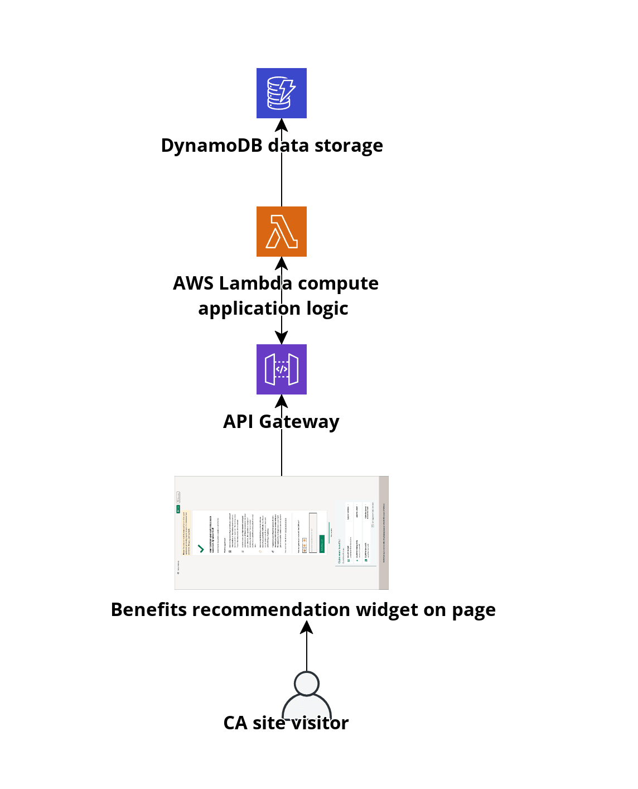

# Benefits recommendation widget API

The benefits recommendation widget is an embeddable web component that presents links to apply for California benefits available to individudals.

## Function

This widget receives requests for benefit links when widgets load on pages. It accepts available information about the current site, user info like language preference. This API will return the set of benefits links to present as json.

The frontend widget records user activity events like: widget render, clicks on links and posts this interaction data to the API as well

This widget will be placed on different sites which aren't currently using google analytics or don't have the state GA tag available so we don't have a client side way to report to GA. It isn't desirable to embed a GA tag inside the widget because of client side weight. We can explore reporting events to the GA API though.



## Test

Local tests can be run via:

```
node tests/http-test.js
```

Test scripts fire up the sandbox server with dependencies and are run using `tape`

Expected output from successful test:

```
TAP version 13
# sandbox.start
ok 1 sandbox started on http://localhost:3333
# get /
ok 2 got 200 response
# post /event
ok 3 got event response back
# sandbox.end
ok 4 sandbox ended

1..4
# tests 4
# pass  4

# ok
```

## Built with

### FAAS & DynamoDB

This API is based on the AWS Function As A Service (FAAS) offering: AWS Lambda. This is the most mature FAAS option available from all cloud providers and gets you all the FAAS benefits of managed scalability, resilience and low cost as well as quick(sub second when the total code payload is under 5MB) cold starts.

The AWS Lambda functions will be storing event data in DynamoDB. This managed NoSQL database option from AWS is designed to handle FAAS interactions which can quickly horizontally scale and temporarily spike the inbound data connections.

### The Architect project

This application is built with the <a href="https://openjsf.org/projects/">JS Foundation backed</a> project <a href="https://arc.codes/">Architect</a>.

The Architect project helps with creating and managing AWS infrastructure for AWS Lambda based applications.

AWS Lambda can be utilized without any framework or with alternate frameworks like <a href="https://www.serverless.com/">the serverless framework</a>.

Architect is helpful for starting out because:

- You get a local development environment immediately that is equivalent to the cloud setup including FAAS endpoints and DynamoDB tables
- You get your infrastructure completely modeled in code from the beginning.
  - There is no manual setup or configuration of AWS services like S3, API Gateway, Lambda, DynamoDB.
  - All infrastructure assets are created based on directions coded in the app.arc file.
  - The setup command can be run in a new region or entirely new AWS account to reproduce the same set of AWS services
  - The app.arc manifest file provides a shorthand for infrastructure setup that is translated into AWS CloudFormation by Architect
- You have built in commands to deploy to multiple versions of your application so there is a staging and production instance including all infrastructure pieces by default.

#### No lockin

This framework speeds up initial development but the code for the individual lambdas is written in the same node.js code you could paste directly into the AWS Lambda online code editor. If you want to abandon the architect framework you can still use all the code you have written.

# Throttling

This widget is deployed in partnership with the agencies linked to. We need to be conscious of their application load and not overwhelm them with spikes. We can do this by throttling the widget display frequency.

This can be easily controlled at the AWS API Gateway. We can set a throttle level of 0 and the Lambda will not respond to any requests. This is helpful for short test runs which have been requested by our partners. The widget is designed to fail gracefully, if the API does not respond the frontend will never display any HTML to the end user.

## Event tracking

This widget also accepts information about widget placement and user interactions like:

- Counts of when widget is rendered on a page
- URL of page it is included on
- Whether it reached the user's viewport area. It may have been rendered near the bottom of a page and never gotten scrolled to. In that case it wouldn't report reaching user's viewport.
- User browser information:
  - user agent string
  - any user defined language preference
- Clicks on any links presented inside the widget

### Sample data sructure

| event            | timestamp     | displayUrl                | userAgent                                                                                                             | language | link                           |
| ---------------- | ------------- | ------------------------- | --------------------------------------------------------------------------------------------------------------------- | -------- | ------------------------------ |
| render           | 1658256582717 | https://edd.ca.gov/status | Mozilla/5.0 (Macintosh; Intel Mac OS X 10_15_7) AppleWebKit/537.36 (KHTML, like Gecko) Chrome/103.0.0.0 Safari/537.36 | en-US    |                                |
| entered viewport | 1658256582717 | https://edd.ca.gov/status | Mozilla/5.0 (Macintosh; Intel Mac OS X 10_15_7) AppleWebKit/537.36 (KHTML, like Gecko) Chrome/103.0.0.0 Safari/537.36 | en-US    |                                |
| click            | 1658256627366 | https://edd.ca.gov/status | Mozilla/5.0 (Macintosh; Intel Mac OS X 10_15_7) AppleWebKit/537.36 (KHTML, like Gecko) Chrome/103.0.0.0 Safari/537.36 | en-US    | https://www.caliheapapply.com/ |

## Development

This API is created using <a href="https://arc.codes/docs/en/get-started/quickstart">arc.codes</a>

Run automated tests:
These tests will hit the api, then query it to make sure records are being saved, this all runs against the local DynamoDB emulator so does not put data into staging or production AWS databases

```
npm test
```

Fetch environment variables for local testing:

```
npx arc env
```

Run locally for testing:

```
npx arc sandbox
```

Deploy to staging via:

```
npx arc deploy
```

Which will created endpoints at https://7ksmy2xna5.execute-api.us-west-1.amazonaws.com

Deploy to production using:

```
npx arc deploy --production
```

Will create endpoints at: https://k61aw4mwkc.execute-api.us-west-1.amazonaws.com

# Database seeding

For local development, feel free to add any mock DynamoDB data to the `sandbox-seed.js` file.

More info available here: https://arc.codes/docs/en/reference/cli/sandbox
